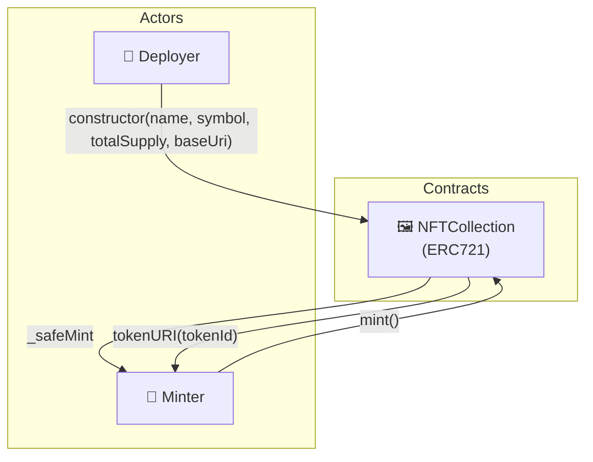

# 🖼️ ERC721Project

[](https://github.com/noelialuz/ERC721Project)
[](https://soliditylang.org/)
[](https://getfoundry.sh/)
[](https://opensource.org/licenses/MIT)

> **A Foundry-based ERC-721 NFT collection where anyone can mint sequential tokens up to a fixed supply cap.**

ERC721Project is a learning-oriented smart contract project that demonstrates a minimal NFT collection built on OpenZeppelin's `ERC721`. Users call a public `mint()` function to receive the next available token ID. Metadata URIs are derived from a configurable base URI and follow the `{baseUri}{tokenId}.json` pattern, suitable for IPFS-hosted assets.

**Key features:**

- 🎨 OpenZeppelin `ERC721` with `_safeMint` and custom `tokenURI` override
- 🔢 Sequential token IDs starting at `0`, capped by a constructor-defined `totalSupply`
- 🌐 IPFS-friendly metadata URIs (`baseUri` + `tokenId` + `.json`)
- 📣 `MintNFT` event emitted on every successful mint
- 🛡️ Checks-Effects-Interactions (CEI) pattern inside `mint()`
- ✅ Full unit test suite (5 tests) covering initialization, minting, metadata, and edge cases
- 🚀 Foundry deployment script with environment-based private key

---

## 📋 Table of Contents

1. [Prerequisites & Dependencies](#-prerequisites--dependencies)
2. [Technologies & Versions](#-technologies--versions)
3. [Project Structure](#-project-structure)
4. [Quick Start](#-quick-start)
5. [Running Tests](#-running-tests)
6. [Architecture](#-architecture)
7. [Security Policy](#-security-policy)
8. [Scripts & Commands](#-scripts--commands)
9. [License](#-license)
10. [About the Author](#-about-the-author)

---

## 📦 Prerequisites & Dependencies

### System requirements

| Requirement | Notes |
| :-- | :-- |
| 🖥️ **OS** | macOS, Linux, or Windows (WSL recommended) |
| 🦀 **Foundry** | [Install Foundry](https://book.getfoundry.sh/getting-started/installation) — includes `forge`, `cast`, and `anvil` |
| 🔧 **Git** | Required for cloning and managing submodules |

Install Foundry:

```bash
curl -L https://foundry.paradigm.xyz | bash
foundryup
```

Verify the installation:

```bash
forge --version
```

### Project dependencies

Dependencies are managed as Git submodules under `lib/` and pinned in [`foundry.lock`](./foundry.lock).

| Dependency | Version | Purpose |
| :-- | :-- | :-- |
| [OpenZeppelin Contracts](https://github.com/OpenZeppelin/openzeppelin-contracts) | `v5.6.1` | `ERC721`, `Strings` |
| [forge-std](https://github.com/foundry-rs/forge-std) | `v1.16.1` | Foundry testing utilities and cheatcodes |

> [!WARNING]
> When installing OpenZeppelin via git, avoid tracking the `master` branch. Use tagged releases (for example `@v5.6.1`) so builds stay reproducible. See the [OpenZeppelin Foundry installation notes](https://github.com/OpenZeppelin/openzeppelin-contracts/blob/master/README.md#foundry-git).

Install or update dependencies explicitly:

```bash
forge install foundry-rs/forge-std@v1.16.1
forge install OpenZeppelin/openzeppelin-contracts@v5.6.1
```

---

## 🛠 Technologies & Versions

| Technology | Version | Role |
| :-- | :-- | :-- |
| **Solidity** | `0.8.35` | Smart contract language |
| **Foundry (forge)** | `1.7.1+` | Build, test, and deploy toolchain |
| **OpenZeppelin Contracts** | `v5.6.1` | Battle-tested ERC-721 implementation |
| **forge-std** | `v1.16.1` | Test helpers, cheatcodes, assertions |
| **Git submodules** | — | Dependency management via `lib/` |

---

## 📁 Project Structure

```bash
ERC721Project/
├── 📂 src/
│   └── NFTCollection.sol           # ERC-721 collection: mint, tokenURI, supply cap
├── 📂 test/
│   └── NFTCollection.t.sol         # NFTCollection unit tests (5 tests)
├── 📂 script/
│   └── DeployNFTCollection.s.sol   # Foundry deployment script
├── 📂 lib/
│   ├── forge-std/                    # Foundry standard library (submodule)
│   └── openzeppelin-contracts/       # OpenZeppelin contracts (submodule)
├── 📂 cache/                         # Foundry compilation cache (auto-generated)
├── 📂 out/                           # Compiled artifacts & ABIs (auto-generated)
├── foundry.toml                      # Foundry project configuration
├── foundry.lock                      # Pinned dependency versions
└── README.md
```

---

## 🚀 Quick Start

### 1. Clone the repository

```bash
git clone https://github.com/noelialuz/ERC721Project.git
cd ERC721Project
```

### 2. Install dependencies

```bash
forge install
```

If submodules are missing, run the explicit install commands from the [Prerequisites](#-prerequisites--dependencies) section.

### 3. Compile the contracts

```bash
forge build
```

A successful build produces artifacts in `out/` and updates the cache in `cache/`.

### 4. Run the test suite

```bash
forge test
```

### 5. Format the code (optional)

```bash
forge fmt
```

Check formatting without modifying files:

```bash
forge fmt --check
```

### Usage overview

Deploy `NFTCollection` with collection metadata and a supply cap, then mint tokens:

```solidity
// 1. Deploy NFTCollection with name, symbol, totalSupply, and baseUri.
// 2. User calls mint() to receive the next sequential token ID.
// 3. tokenURI(tokenId) returns baseUri + tokenId + ".json".
```

Example test flow with Foundry cheatcodes:

```solidity
vm.prank(user);
nft.mint();

assertEq(nft.ownerOf(0), user);
assertEq(nft.tokenURI(0), string.concat(baseUri, "0.json"));
```

---

## 🧪 Running Tests

### Run all tests

```bash
forge test
```

Expected output includes a summary table:

```text
╭-------------------+--------+--------+---------╮
| Test Suite        | Passed | Failed | Skipped |
+===============================================+
| NFTCollectionTest | 5      | 0      | 0       |
╰-------------------+--------+--------+---------╯
```

### Verbose output

Show logs and traces for each test:

```bash
forge test -vvv
```

Maximum verbosity (stack traces on failure):

```bash
forge test -vvvv
```

### Run a specific test file

```bash
forge test --match-path test/NFTCollection.t.sol
```

### Run a single test function

```bash
forge test --match-test test_MintSuccessful
```

### Gas report

Generate a gas usage report for all tests:

```bash
forge test --gas-report
```

### Test coverage

```bash
forge coverage
```

### Test suites covered

| Suite | Tests | Scope |
| :-- | :-- | :-- |
| `NFTCollectionTest` | 5 | Constructor setup, minting, token URI, sold-out guard, nonexistent token revert |

---

## 🗄 Architecture

ERC721Project consists of a single main contract and two actor roles:



#### Contract responsibilities

| Contract | Responsibility |
| :-- | :-- |
| **`NFTCollection`** | ERC-721 collection with sequential public minting, supply cap, and metadata URI generation |

#### Core state

| Variable | Description |
| :-- | :-- |
| `currentTokenId` | Next token ID to mint; also acts as a mint counter |
| `totalSupply` | Maximum number of tokens that can ever be minted |
| `baseUri` | Prefix for metadata URIs (e.g. an IPFS gateway or CID path) |

#### User flow

1. **Mint** — Any address calls `mint()` to receive the next available token ID via `_safeMint`.
2. **Metadata** — Wallets and marketplaces call `tokenURI(tokenId)` to resolve `{baseUri}{tokenId}.json`.
3. **Sold out** — Once `currentTokenId` reaches `totalSupply`, further mint attempts revert with `"Sold Out"`.

#### Deployment flow

1. **Configure** — Set collection name, symbol, max supply, and base metadata URI in the constructor.
2. **Deploy** — Use [`script/DeployNFTCollection.s.sol`](./script/DeployNFTCollection.s.sol) with a `PRIVATE_KEY` environment variable.
3. **Mint** — Users interact with the deployed contract through `mint()`.

---

## 🔐 Security Policy

> ⚠️ **This project is intended for learning and demonstration purposes only.** It has **not** undergone a professional security audit.

### Known considerations

| Area | Detail |
| :-- | :-- |
| 🎓 **Educational scope** | Not production-ready; use at your own risk |
| 🌍 **Public mint** | `mint()` is unrestricted — anyone can mint until the supply cap is reached |
| 💸 **No payment logic** | Minting is free; no ETH or ERC-20 payment is enforced |
| 🔒 **Immutable metadata base** | `baseUri` is set at deployment and cannot be updated on-chain |
| 🛡️ **Safe mint** | `_safeMint` enforces ERC-721 receiver checks for contract recipients |
| 📦 **Dependencies** | Keep OpenZeppelin and forge-std on tagged releases aligned with `foundry.lock` |

### Before using in production

- [ ] Review minting and metadata logic in [`src/NFTCollection.sol`](./src/NFTCollection.sol)
- [ ] Run the full test suite: `forge test`
- [ ] Consider a professional audit
- [ ] Add access control, payment, or allowlist mechanisms as needed
- [ ] Keep dependencies pinned to tagged releases

### Reporting vulnerabilities

If you discover a security issue, please **do not** open a public GitHub issue. Contact the repository owner directly (see [About the Author](#-about-the-author)).

Smart contracts carry inherent technical and financial risk. Use this repository at your own responsibility.

---

## 📜 Scripts & Commands

| Command | Description |
| :-- | :-- |
| `forge build` | Compile all contracts |
| `forge test` | Run the full test suite |
| `forge test -vvv` | Run tests with detailed traces |
| `forge test --gas-report` | Show gas usage per function |
| `forge coverage` | Generate test coverage report |
| `forge fmt` | Format Solidity source files |
| `forge fmt --check` | Verify formatting (CI-friendly) |
| `forge clean` | Remove `cache/` and `out/` artifacts |
| `anvil` | Start a local Ethereum node for manual testing |
| `cast call <addr> <sig>` | Read on-chain state from a deployed contract |
| `cast send <addr> <sig>` | Send a transaction to a deployed contract |

### Deploy with Foundry

The project includes a deployment script at [`script/DeployNFTCollection.s.sol`](./script/DeployNFTCollection.s.sol). Set your deployer private key and broadcast:

```bash
export PRIVATE_KEY=<your_private_key>
forge script script/DeployNFTCollection.s.sol --rpc-url <RPC_URL> --broadcast
```

Default constructor parameters in the script:

| Parameter | Default value |
| :-- | :-- |
| Name | `"None NFT"` |
| Symbol | `"NLFNFT"` |
| Total supply | `2` |
| Base URI | `ipfs://bafybeiggbczrqjigvsr4v3eaeawyhq2gk2ywftjy3kawh4elecjffdlptu/` |

Simulate without broadcasting:

```bash
forge script script/DeployNFTCollection.s.sol --rpc-url <RPC_URL>
```

---

## 📄 License

ERC721Project is released under the [MIT License](https://opensource.org/licenses/MIT).

SPDX identifiers in source files: `// SPDX-License-Identifier: MIT`

---

## 👤 About the Author

| | |
| :-- | :-- |
| **Name** | Noelia Luz Fernández |
| **GitHub** | [@Noelialuz](https://github.com/noelialuz) |
| **LinkedIn** | https://www.linkedin.com/in/noelia-luz-fernandez-03404440/ |
| **Email** | noelia_luz_fernandez@hotmail.com |

---

## 📚 Learn More

- [Foundry Book](https://book.getfoundry.sh/) — compilation, testing, and cheatcodes
- [OpenZeppelin Contracts documentation](https://docs.openzeppelin.com/contracts) — ERC-721 and metadata standards
- [OpenZeppelin Contracts repository](https://github.com/OpenZeppelin/openzeppelin-contracts) — dependency source and release tags
- [ERC-721 standard](https://eips.ethereum.org/EIPS/eip-721) — non-fungible token interface specification
